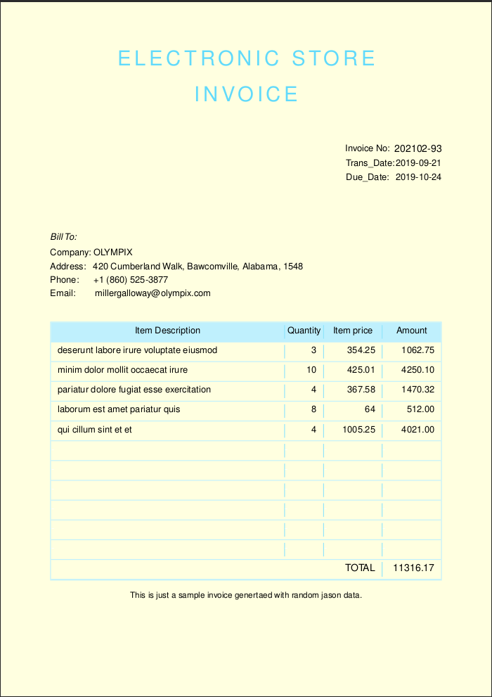
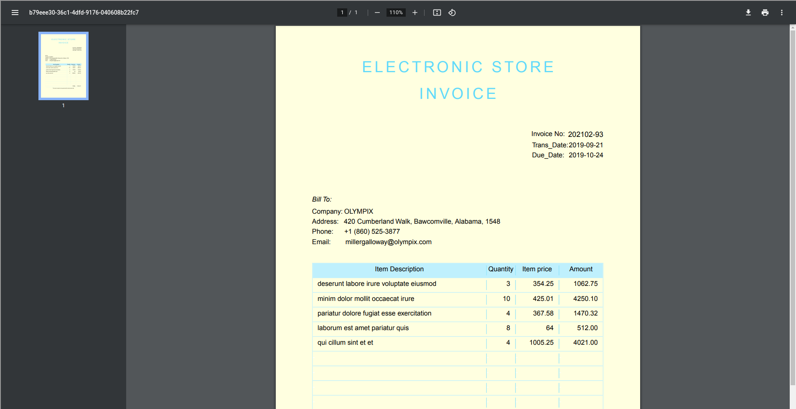

# React-printable-invoice
It is a simple printable(converted to pdf) invoice form made in react js


## Getting Started

From the terminal window, run the following command to create the project.
```
npx create-react-app react-invoice
```

Change directory to the project folder by running
```
cd react-invoice
```

After the project has been created, run the following command from a terminal window to install @react-pdf/renderer package.
```
npm install @react-pdf/renderer --save
```
*if it doesnt work cause of some errors then add the use --force, but recommended not to*

Start the application by running 
```
npm start
```

## Generating input json data

You can create teh input json data manually but here I am using [json generator](https://www.json-generator.com/) to get random json data in the specified format I need

The format of input data I requested was of this:
```js
{
    id: '{{objectId()}}',
    invoice_no: '{{date(new Date(2019, 0, 1), new Date(), "YYYYMM")}}-{{integer(100)}}',
    balance: '{{floating(1000, 4000, 2, "$0,0.00")}}',
    company: '{{company().toUpperCase()}}',
    email: '{{email()}}',
    phone: '+1 {{phone()}}',
    address: '{{integer(100, 999)}} {{street()}}, {{city()}}, {{state()}}, {{integer(100, 10000)}}',
    trans_date: '{{date(new Date(2019, 8, 1), new Date(2019,8,31), "YYYY-MM-dd")}}',
    due_date: '{{date(new Date(2019, 9, 4), new Date(2019,9,31), "YYYY-MM-dd")}}',
    items: [
      '{{repeat(5)}}',
      {
        sno: '{{index(1)}}',
        desc: '{{lorem(5, "words")}}',
        qty: '{{integer(2, 10)}}',
        rate: '{{floating(8.75, 1150.5, 2)}}'
      }
    ]
  }
```
When you paste this code and click on ***Generate*** then you will get the json data as requested.

Create a file in the src folder naming "Data" and inside that create a file named "invoice-data.js" inside that paste the json data generated as the value of a variable and export taht variable for its usage.

## Components

To structure our printable invoice, the following components will be of interest to us.

<Document> represents the PDF document itself. It must be the root of the document tree element structure. It should only contain children of type <Page /> component.

Page - represents a single page within a PDF document. <Page /> has a default size of A4 with a portrait orientation.

View - is the fundamental component used for building the UI. It is designed to be nested inside other views and can have zero or more child components.

Text - component is used for displaying text. It supports nesting of other <Text /> components.

Image - component is used for displaying images. Images may be JPG, PNG or base64 encoded image strings.(used here only if you have a logo to display)

PDFViewer - component will be used for displaying the PDF documents within the web browser.

More information is availble in [recat_pdf documentation](https://react-pdf.org/)

## Main component

In the src folder create a file named "Invoice.js", this will serve as the main component and will import other sub components such as title, table, date  and other details into this and import this "invoice" varibale into the app.js to finally render the invoice.
```js
import React from 'react';
import { Page, Document, Image, StyleSheet } from '@react-pdf/renderer';
import InvoiceTitle from './InvoiceTitle'
import BillTo from './BillTo'
import InvoiceNo from './InvoiceNo'
import InvoiceItemsTable from './InvoiceItemsTable'
import InvoiceThankYouMsg from './InvoiceThankYouMsg'

const styles = StyleSheet.create({
    page: {
        fontFamily: 'Helvetica',
        fontSize: 11,
        paddingTop: 30,
        paddingLeft:60,
        paddingRight:60,
        lineHeight: 1.5,
        backgroundColor: '#ffffe0',
        flexDirection: 'column',
    }, 
  });

  const Invoice = ({invoice}) => (
    <Document>
        <Page size="A4" style={styles.page}>
            <InvoiceTitle title='Invoice' /> 
            <InvoiceNo invoice={invoice}/>
            <BillTo invoice={invoice}/>
            <InvoiceItemsTable invoice={invoice} />
            <InvoiceThankYouMsg />
        </Page>
    </Document>
);

export default Invoice
```
This is my Invoice.js file  which contains all the sub components teh come under that perticular pdf.

## Other components

Other componenst(which all are imported in the main Invoice.js file are to be made respectively,

For title, invoice_no or for rows I have used the react fragments - A common pattern in React is for a component to return multiple elements. Fragments let you group a list of children without adding extra nodes to the DOM, so it cam=n make it easier when you have to handle simmilar but multiple type of data.

To work on the items in invoice data, we will pass the invoice line items data to this component and using map function, we will iterate through the line items to create individual rows. Invoice table isn't always full so leaving some blank spaces is better to maintain consistent invoice items table, So teh number of blank rows required to add will be dependent on the lines of rows you require on your invoice and the number of line items in each invoice.

The implementation for rows or for adding blank rows using map function is as follows:
```js
const InvoiceTableRow = ({items}) => {
    const rows = items.map( item => 
        <View style={styles.row} key={item.sno.toString()}>
            <Text style={styles.description}>{item.desc}</Text>
            <Text style={styles.qty}>{item.qty}</Text>
            <Text style={styles.rate}>{item.rate}</Text>
            <Text style={styles.amount}>{(item.qty * item.rate).toFixed(2)}</Text>
        </View>
    )
    return (<Fragment>{rows}</Fragment> )
};
```
Rest of the components can be made simply by importing the json data.

## Displaying the pdf page

In the app.js you have to import the Invoice varibale from the Invoice.js and the invoiceData from the invoice-data.js to render the invoice form
```js
class App extends Component {
  render() {
    return (
        <Fragment>
            <PDFViewer width="1730" height="1000" className="app" >
                <Invoice invoice={invoiceData}/>
            </PDFViewer>
        </Fragment>
    );
  }
}
```

## PDF viewing and downloading

As said, it is displayed in the browser in the form of a pdf and then you just press [ctr+P] to print or save as pdf or you can just download it.

